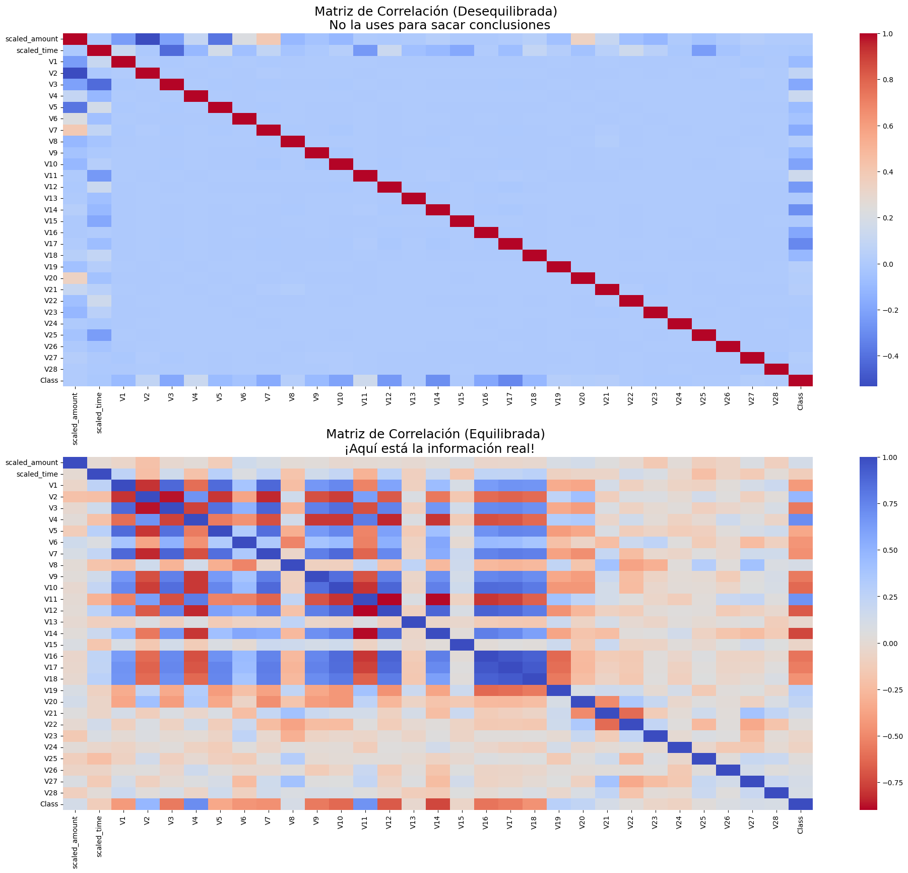

# fraud-detection-consulting
Optimización de modelos de Machine Learning para detección de fraude financiero. Comparativa estratégica entre Under-sampling y SMOTE aplicada a Regresión Logística y Random Forest para la gestión de riesgo bancario

# 🛡️ Detección de Fraude Bancario: Un Enfoque de Consultoría Estratégica

## 📌 Resumen Ejecutivo
Este proyecto aborda un desafío crítico en el sector financiero: la detección de transacciones fraudulentas en tiempo real en un dataset altamente desbalanceado.

Analizando más de 280,000 transacciones donde el fraude representa apenas el **0.17%**, el objetivo principal no fue solo maximizar la detección técnica, sino encontrar el equilibrio estratégico entre dos KPIs de negocio opuestos:
1.  **Minimizar Pérdidas Financieras:** Capturar la mayor cantidad de fraude posible (Alto Recall).
2.  **Proteger la Experiencia del Cliente:** Evitar bloquear tarjetas legítimas por error (Alta Precisión).

---

## 🛠️ Metodología y Desafío Técnico

El principal reto fue la escasez de datos de fraude. Se implementaron y compararon diferentes estrategias de ingeniería de datos para superar esto:

* **Preprocesamiento Robusto:** Uso de `RobustScaler` para neutralizar el impacto de valores atípicos extremos en los montos de transacción.
* **Estrategia de Muestreo A (Under-sampling):** Reducción de la clase mayoritaria para un prototipado rápido y eficiente.
* **Estrategia de Muestreo B (SMOTE):** Generación de datos sintéticos para entrenar con el volumen completo.
    * *Datos Reales:* 396 fraudes.
    * *Datos tras SMOTE:* 226,584 fraudes sintéticos (Equilibrado).

### 📊 Visualización del Impacto del Balanceo
El desbalance oculta los patrones. Al equilibrar los datos, las verdaderas correlaciones del fraude emergen claramente:

*Figura 1: La matriz inferior (equilibrada) revela fuertes correlaciones negativas (rojo intenso) en variables como V14 y V12 que estaban ocultas en el dataset original.*

---

## 📈 Benchmark de Rendimiento (Resultados Reales)

Se evaluaron tres escenarios para determinar el modelo óptimo para producción:

| Estrategia | Algoritmo | Precision (Fiabilidad) | Recall (Detección) | Análisis del Consultor |
| :--- | :--- | :--- | :--- | :--- |
| **Línea Base** | Logística + Under-sampling | **94%** | **87%** | Excelente equilibrio y rapidez para un primer despliegue. |
| **Experimento** | Logística + SMOTE | 4% | 88% | **Inviable.** El ruido sintético destruyó la fiabilidad del modelo. |
| **Solución Final**| **Random Forest + SMOTE** | **91%** | **81%** | Modelo robusto que recupera la precisión y maneja la complejidad. |

---

## 🧠 Análisis Profundo: La Trampa de la Complejidad

### El Fracaso de SMOTE con Modelos Lineales
El intento de usar SMOTE con una Regresión Logística simple resultó en un fracaso operativo. El modelo no pudo distinguir entre transacciones reales y el "ruido" generado sintéticamente, resultando en una precisión del 4%.
> **Impacto de Negocio:** De cada 100 bloqueos de tarjeta, 96 serían a clientes inocentes. Inaceptable para un banco.

*Figura 2: La Regresión Logística con SMOTE generó 1470 Falsos Positivos (esquina superior derecha), desplomando la precisión.*

### La Solución Robusta: Random Forest
Al aplicar un algoritmo de ensamble (Random Forest), logramos "domar" los datos sintéticos de SMOTE. El modelo fue capaz de aprender fronteras de decisión complejas, elevando la precisión de nuevo a un nivel de producción (91%).

*Figura 3: El Random Forest redujo drásticamente los falsos positivos a solo 6, ofreciendo un sistema altamente fiable.*

---

## 💡 Recomendación Final del Consultor

Para una institución financiera que prioriza la **reducción de la fricción con el cliente** y la **estabilidad a largo plazo**, se recomienda la implementación del modelo **Random Forest con entrenamiento SMOTE**.

Aunque su tasa de detección (Recall 81%) es ligeramente inferior a la línea base, su **Precisión del 91%** garantiza que el equipo de revisión de fraudes no pierda tiempo en falsas alarmas y que los clientes legítimos no sufran bloqueos injustificados.

---
**Autor:** Sebastian David Gutierrez Ferreira
*Data Science & Analytics Portfolio*
[Enlace a tu LinkedIn]
